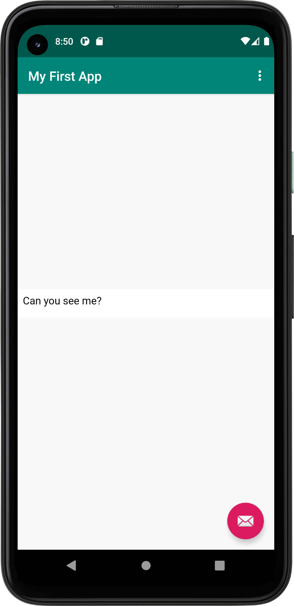

Jag började med att döpa om min app vilket gjordes i strings.xml. Jag döpte appen til: My First App, nedan är koden.

    <string name="app_name">My First App</string>

Efter det skulle jag möjliggöra för internetåtkomst vilket gjordes i androidmanifest.xml genom att lägga till följande kod:

    <manifest xmlns:android="http://schemas.android.com/apk/res/android"
    package="com.example.webviewapp">

    <uses-permission android:name="android.permission.INTERNET" />

Efter det skulle ett webview element skapas i content_main.xml och då ersatte jag textview blocket med följande kod.
     WebView
             android:id="@+id/my_webview"
             android:layout_width="wrap_content"
             android:layout_height="wrap_content"
             android:text="Hello World!"
             app:layout_constraintBottom_toBottomOf="parent"
             app:layout_constraintLeft_toLeftOf="parent"
             app:layout_constraintRight_toRightOf="parent"
             app:layout_constraintTop_toTopOf="parent" /><

Jag gav den ett ID genom att lägga till följande kod i samma block (är inkluderat i kodblocket i stycket över också):

       android:id="@+id/my_webview"

Efter det skapades en variabel av typen WebView i metoden onCreate(), i mainactivity.java, jag initsierade variabeln utanför oncreatemetoden
högst upp i klassen:

    private WebView myWebView;

     @Override
        protected void onCreate(Bundle savedInstanceState) {
            super.onCreate(savedInstanceState);
            setContentView(R.layout.activity_main);
            myWebView = findViewById(R.id.my_webview);

För att hitta WebView elementet med hjälp av dess iD:

    findViewById(R.id.my_webview)

För att möjliggöra för javascript utförande i min webviewclient så lades förlajnde rad kod till i oncreate metoden:
 myWebView.getSettings().setJavaScriptEnabled(true);

 Jag lade till en asset folder genom att trycka på new, folder, asset folder. Samt ytterligare en mapp som jag döpte
 till img, i denna mapp skapade jag en html fil genom att simpelt gå till new och sedan välja file.

För att implementera att kunna visa interna och externa websidor så la jag till "myWebView.loadUrl()" i de redan existerande metoderna i
mainactivity, den extarna ska visa his.se och den interna visar min html fil. Koden i metoderna:

  public void showExternalWebPage(){

         myWebView.loadUrl("https://www.his.se");
     }

  public void showInternalWebPage(){

         myWebView.loadUrl("file:///android_asset/img/about.html");
     }

För att kalla metoderna när någon trycker på intern respektive extern så lade jag till showExternalWebPage(); i if-satsen där
external-alternativet är valt. Samma princip för internal, dett så att när nåogon av de två alternativen så kallas metoderna som
implimenterades i föregånde steg. Metoderna kallades i metoden "onOptionesItemSelected"

   @Override
    public boolean onOptionsItemSelected(MenuItem item) {
        int id = item.getItemId();

        if (id == R.id.action_external_web) {
            Log.d("==>","Will display external web page");
            showExternalWebPage(); <----// kallar metoden
            return true;
        }

        if (id == R.id.action_internal_web) {
            Log.d("==>","Will display internal web page");
            showInternalWebPage(); <----// kallar metoden
            return true;
        }

        return super.onOptionsItemSelected(item);
    }
}

